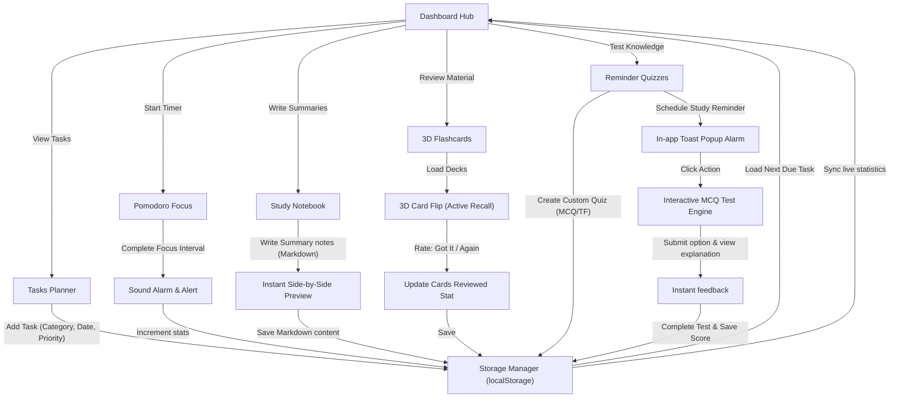

# StudyFlow 🚀
> A Premium Single-Page Study Planner & Productivity Suite

**StudyFlow** is a sleek, modern, glassmorphic Single Page Application (SPA) designed to help students optimize their learning sessions. It integrates time management, active recall, organization, and self-testing into a unified dashboard.

---

## 🗺️ Workflows & Architecture

The diagram below illustrates how StudyFlow connects different learning modules to establish an effective study loop:



---

## ✨ Features Detail

### 1. 📊 Central Dashboard Hub
- **Ambient Design**: Built using high-end dark mode Glassmorphism style (`backdrop-filter: blur(16px)` and translucent card gradients).
- **Goal Indicators**: Displays cumulative study metrics: focus minutes, card counts, and quiz completion ratios.
- **Smart Queue**: Computes and displays the next priority task due.
- **Daily Inspiration**: Automatically rotates motivational scientific learning quotes based on the calendar day.

### 2. 📝 Tasks Planner
- **Task Meta**: Set priority levels (High, Medium, Low) and custom category tags (e.g., *Math*, *Coding*).
- **Dating**: Tracks target due dates, highlighting overdue items.
- **Sorting**: Instantly filter list items (All, Pending, Completed) and sort them by priority weight, due dates, or alphabetically.

### 3. ⏱️ Pomodoro Focus Timer
- **Circled Progress SVG**: Renders a smooth circular progress indicator matching the ticking countdown.
- **Sound Laboratory (Web Audio API)**: Generates synthesized study soundscapes locally without external media dependancies:
  - *White Noise* (for static masking)
  - *Ocean Waves* (modulated with a slow low-frequency oscillator)
  - *Soft Rain* (pink noise with randomized rain drop clicks)
  - *Soft Focus Clock Ticking* (binaural rhythmic beats)
- **Phase Presets**: Single-click focus (25m), short breaks (5m), and long breaks (15m).

### 4. 📒 Study Notebook (Markdown Support)
- **Dual Column Split View**: Live editing pane on the left with markdown translation previews on the right.
- **Instant Search**: Find sheets instantly by searching titles, content, or category tags.
- **Markdown Rules**: Translates headers (`#`, `##`), text decorations (`**bold**`, `*italics*`), code lines (`` `inline` ``), and bullet lists.

### 5. 🎴 3D Flashcards
- **Interactive 3D Mechanics**: Rotates cards in 3D space (`transform-style: preserve-3d`) on hover/click to simulate physical card interactions.
- **Rate Matrix**: Grade reviews using "I Got It!" or "Review Again" to advance the study progress bar and update dashboard stats.

### 6. 🧠 Reminder Quiz Maker
- **Quiz Creator**: Design custom multiple-choice quizzes with up to 4 custom option strings, a declared correct option, and dedicated explanations.
- **Active MCQ Engine**: Check answers in real-time. Correct/incorrect options light up, and explanation blocks expand.
- **Spaced Reminders**: Set a delay timer. When it triggers, a custom in-app sound and toast banner will slide in, allowing you to launch the quiz with a single click from anywhere in the app.

---

## 🛠️ Technology Stack
- **Core Structure**: Semantic HTML5 & Vanilla Javascript (ES Modules)
- **Styling Layer**: Vanilla CSS3 Custom design tokens (variables, animations, glass cards)
- **Bundler & Dev Server**: Vite (for rapid HMR)
- **Persistent Data**: LocalStorage API
- **Audio Engine**: Web Audio API (for offline synthetic frequency loops and chimes)

---

## 🚀 Local Installation & Setup

1. **Clone the repository**:
   ```bash
   git clone https://github.com/niteshpal2005-eng/studyflow.git
   cd studyflow
   ```

2. **Install dependencies**:
   ```bash
   npm install
   ```

3. **Start the local development server**:
   ```bash
   npm run dev
   ```

4. **Build for production**:
   ```bash
   npm run build
   ```

---

## 📂 Project Structure Map
```
studyflow/
├── index.html            # Main SPA page entrypoint
├── package.json          # Project metadata and script commands
├── .gitignore            # Git exclusion config
├── styles/
│   ├── main.css          # Color variables, sidebar layouts, keyframes
│   └── components.css    # 3D Flip cards, timer rings, notes panels, quiz option grids
└── js/
    ├── app.js            # Main router and dashboard coordinator
    ├── storage.js        # LocalStorage API wrappers & seed data
    ├── todo.js           # Checklist task inputs and filters
    ├── pomodoro.js       # Focus loops and audio synthesizers
    ├── flashcards.js     # Deck carousels and flip ratings
    ├── notes.js          # Notebook lists and markdown parser
    └── quiz.js           # Creator modals, taker options, and device timers
```
